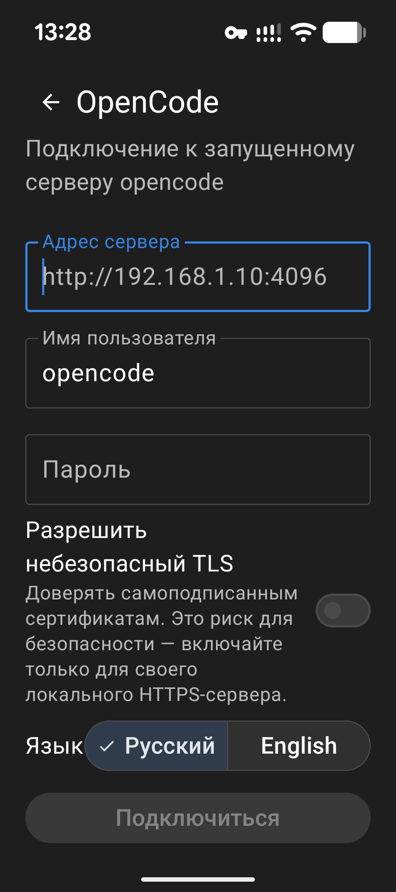
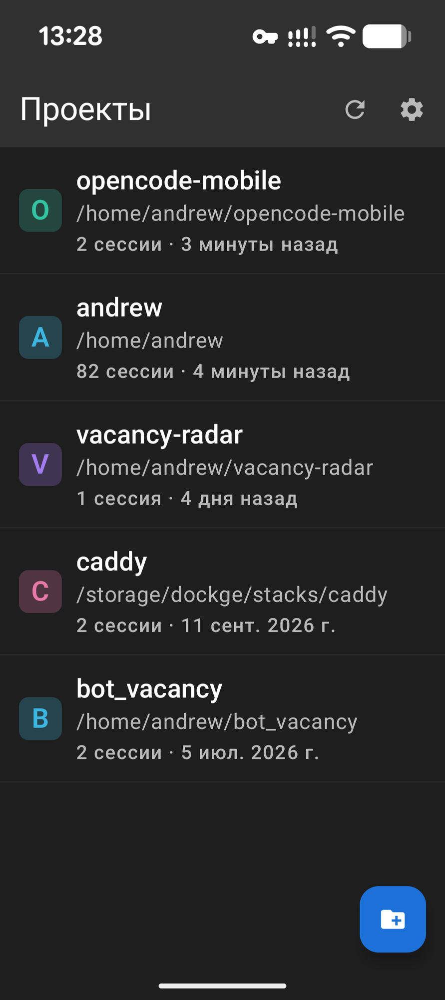
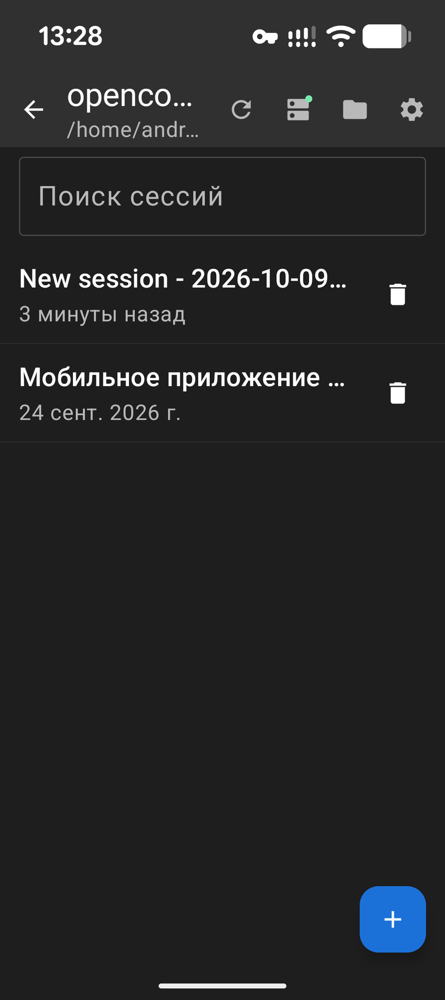
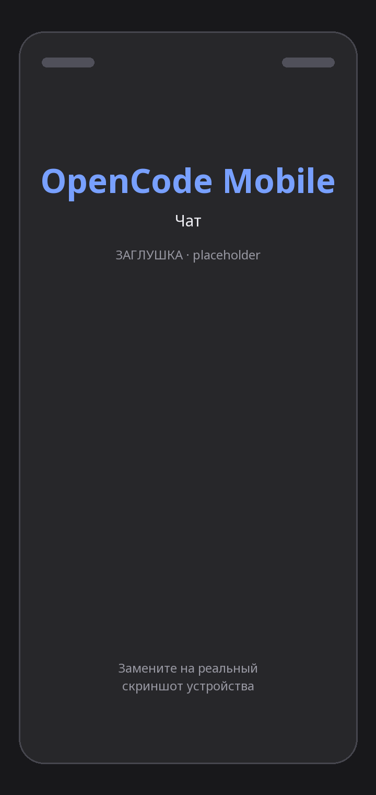
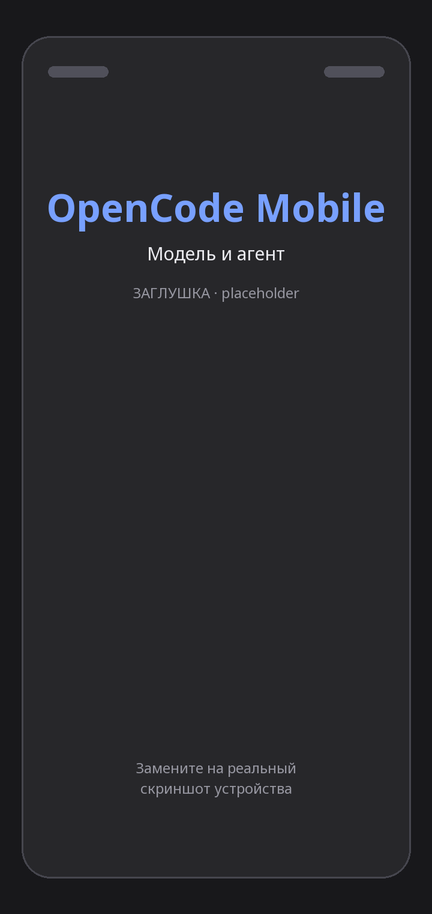
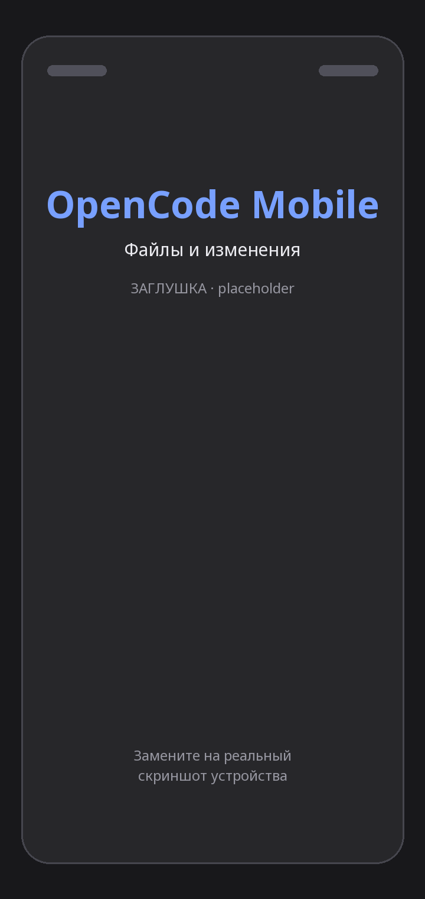
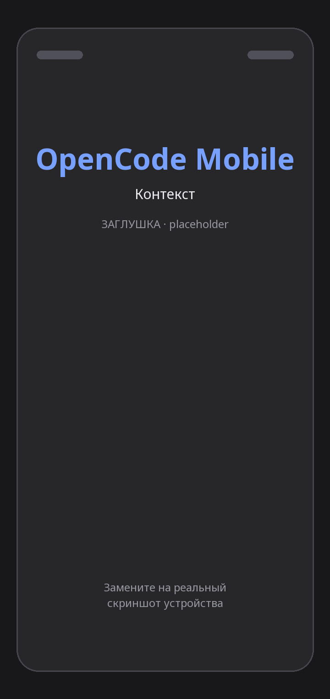
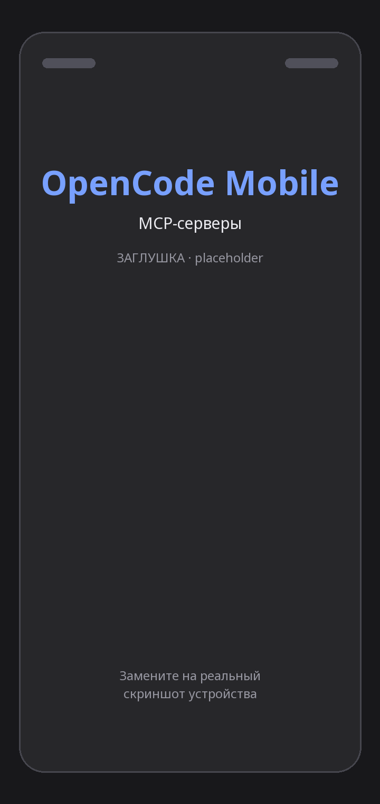

# OpenCode Mobile

Неофициальный Android-клиент для сервера [opencode](https://opencode.ai) — агента для программирования, работающего на вашем компьютере или сервере. Приложение подключается к уже запущенному серверу `opencode` и даёт полноценный мобильный доступ к проектам, сессиям, файлам и чату с моделью прямо с телефона.


---

## Содержание

- [О приложении](#о-приложении)
- [Возможности](#возможности)
- [Скриншоты](#скриншоты)
- [Требования](#требования)
- [Сборка и запуск](#сборка-и-запуск)
- [Подключение к серверу](#подключение-к-серверу)
- [Архитектура](#архитектура)
- [Технологии](#технологии)
- [Тесты](#тесты)
- [Документация](#документация)
- [Участие в разработке](#участие-в-разработке)
- [Лицензия](#лицензия)

---

## О приложении

`opencode` запускает один HTTP-сервер на каждый рабочий каталог (проект) и общается с клиентом по REST и Server-Sent Events (SSE). Этот проект — нативный Android-клиент к такому серверу: он открывает поток событий `/event`, показывает стриминг ответов, карточки разрешений и вопросов, изменения файлов и статус VCS.

Приложение не содержит собственной модели и не выполняет код — вся работа происходит на сервере `opencode`. Телефон выступает тонким, но полнофункциональным клиентом.

- **Application ID:** `ai.opencode.mobile`
- **Язык интерфейса:** русский и английский (переключение в настройках, `values-ru`/`values`)
- **Тема:** светлая и тёмная, edge-to-edge

## Возможности

**Подключение**
- Адрес сервера, Basic Auth (имя пользователя по умолчанию `opencode`), пароль хранится зашифрованным (`SecretCipher`)
- Опция «Разрешить небезопасный TLS» для самоподписанных сертификатов
- Автопереподключение и повторная синхронизация с экспоненциальной задержкой

**Проекты и сессии**
- Список проектов (каталогов) на сервере, добавление и скрытие, выбор рабочего каталога
- Список сессий с поиском, созданием и удалением; активная сессия поднимается наверх
- Бейджи ожидающих разрешений и вопросов прямо в списке сессий

**Чат**
- Стриминг ответов по SSE, локальное эхо отправленного сообщения, кнопка остановки
- Выбор модели, агента и «уровня рассуждений» (варианты модели); управление списком отображаемых моделей
- Карточки разрешений (`Allow once` / `Always` / `Reject`) и вопросов с вариантами ответа и полем своего ответа
- Отображение вызовов инструментов, подзадач, статусов (`running` / `done` / `error`) и шагов
- Рендеринг Markdown (GFM-таблицы, зачёркивание, автоссылки), подсветка ANSI, длинные тексты сворачиваются
- Вложения: файлы с телефона и файлы проекта (изображения, PDF, текст)

**Файлы и изменения**
- Вкладки «Changes», «Files» и «VCS»: просмотр файлов, диффов и статуса рабочего дерева/branch

**Контекст и сервисы**
- Панель использования контекста: токены, стоимость, разбивка по ролям и сообщениям
- Управление MCP-серверами (подключение/отключение)

**Правки**
- Редактирование отправленного сообщения с откатом сессии и возможностью восстановить сообщения

## Скриншоты

Скриншоты лежат в каталоге [`docs/screenshots/`](docs/screenshots/). Положите реальные снимки экрана с указанными ниже именами — галерея подхватит их автоматически.

| Подключение | Проекты | Сессии | Чат |
|:---:|:---:|:---:|:---:|
|  |  |  |  |

| Модель и агент | Файлы и изменения | Контекст | MCP-серверы |
|:---:|:---:|:---:|:---:|
|  |  |  |  |

> Для «Подключения», «Проектов» и «Сессий» уже лежат реальные снимки. Остальные — подписанные заглушки: замените их своими файлами с теми же именами (см. [`docs/screenshots/README.md`](docs/screenshots/README.md)).

## Требования

- **JDK 17** (проект компилируется под Java 17)
- **Android SDK** с платформой **API 35** и **build-tools 35.0.0**
- **Gradle** не нужен отдельно — используется wrapper (`gradle-8.11.1`)
- Устройство или эмулятор на **Android 8.0 (API 26)** и выше
- Запущенный сервер `opencode` (см. ниже)

## Сборка и запуск

Сначала укажите путь к Android SDK одним из способов:

```bash
# вариант 1: переменная окружения
export ANDROID_HOME=$HOME/Android/Sdk

# вариант 2: файл local.properties в корне проекта (не коммитится)
echo "sdk.dir=$HOME/Android/Sdk" > local.properties
```

Сборка и установка debug-варианта:

```bash
# собрать debug APK -> app/build/outputs/apk/debug/app-debug.apk
./gradlew assembleDebug

# собрать и установить на подключённое устройство/эмулятор
./gradlew installDebug

# release-сборка (minify + shrinkResources)
./gradlew assembleRelease
```

Debug-сборка имеет суффикс `applicationId` — `.debug`, поэтому может стоять рядом с release-версией. Release-сборка сейчас подписана debug-ключом: перед распространением замените подпись на собственный keystore.

## Подключение к серверу

Запустите сервер `opencode` на компьютере/сервере и разрешите доступ по сети:

```bash
opencode serve --hostname 0.0.0.0 --port 4096
```

По умолчанию сервер слушает порт **4096**. В приложении на экране подключения укажите:

- **Адрес сервера** — например `http://192.168.1.10:4096` (телефон и сервер должны быть в одной сети)
- **Имя пользователя / пароль** — если сервер использует Basic Auth
- **Разрешить небезопасный TLS** — только для собственного локального HTTPS с самоподписанным сертификатом

## Архитектура

Одноактивное Compose-приложение по схеме MVVM. Единый источник состояния — `AppRepository`, поверх которого работают View-модели и экраны.

```
app/src/main/java/ai/opencode/mobile/
├── OpenCodeApplication.kt        точка входа, создаёт AppRepository
├── MainActivity.kt               единственная Activity, host для Compose
├── data/
│   ├── AppRepository.kt          состояние приложения, поток событий, синхронизация
│   ├── ChatController.kt         состояние чата и свёртка стриминговых событий
│   ├── SelectionStore.kt         выбранные модель, агент, вариант
│   ├── ProjectStore.kt           список проектов и открытый каталог
│   ├── local/                    DataStore-настройки и шифрование пароля
│   └── remote/                   OpenCodeClient (REST + SSE), DTO, JSON
└── ui/
    ├── AppRoot.kt                навигация между экранами
    ├── connect/                  экран подключения/настроек
    ├── projects/ sessions/       проекты и сессии
    ├── chat/                     чат, панели, вложения, откат
    ├── files/                    файлы, изменения, VCS
    ├── markdown/ components/     рендеринг Markdown, вспомогательные UI
    └── theme/                    тема Material 3
```

Ключевые решения:

- **Один `AppRepository` на процесс**, живёт в `Application`; View-модели получают его через фабрики.
- **SSE-поток `/event`** открывается при старте и закрывается в фоне (экономия батареи), с пересинхронизацией при возврате.
- **`OpenCodeClient` stateless** относительно конфигурации: базовый URL, учётные данные и каталог проекта фиксируются на экземпляр; при смене настроек создаётся новый клиент (общий пул соединений OkHttp переиспользуется).
- **Запросы привязаны к конкретному серверу и сессии**, чтобы ответы старого соединения не попадали в новые экраны.

## Технологии

| Область | Стек |
|---|---|
| Язык | Kotlin 2.0.21 |
| UI | Jetpack Compose, Material 3, Navigation Compose |
| Сеть | OkHttp 4.12 + `okhttp-sse`, kotlinx.serialization |
| Асинхронность | Kotlin Coroutines и Flow |
| Хранение | DataStore Preferences, шифрование пароля |
| Markdown | commonmark + GFM (tables, strikethrough, autolink) |
| Сборка | AGP 8.7.3, Gradle 8.11.1, ktlint |
| Тесты | JUnit4, OkHttp MockWebServer, AndroidX Test |

## Тесты

```bash
# модульные тесты (JVM) — не требуют устройства
./gradlew testDebugUnitTest

# статический анализ
./gradlew lintDebug
./gradlew ktlintCheck
```

В проекте более 160 модульных тестов: разбор DTO и событий, свёртка стриминга, работа с сессиями и проектами, откат правок, markdown, ограничения на большие ответы. Есть один инструментальный тест (`app/src/androidTest`).

## Документация

- [Индекс документации](docs/README.md)
- [Исправления по код-ревью](docs/REVIEW_FIXES.md) — разбор проблем стабильности, отзывчивости и UI с историей правок

## Участие в разработке

Правила описаны в [CONTRIBUTING.md](CONTRIBUTING.md). Кратко: следуйте стилю ktlint, добавьте тесты на изменение логики и опишите суть в pull request.

## Лицензия

Лицензия пока не указана. Если планируете распространять или принимать вклад извне — добавьте файл `LICENSE` (например, MIT или Apache-2.0).
